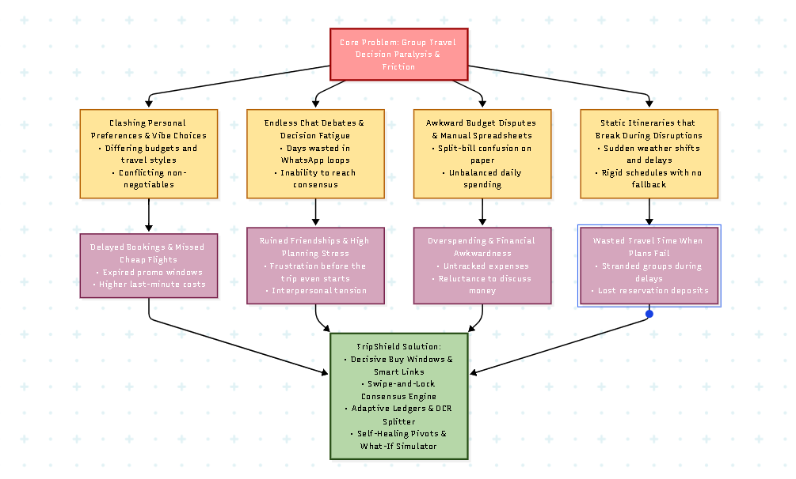
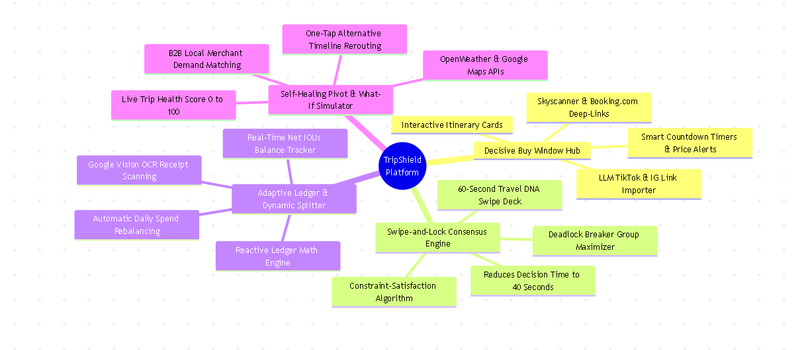
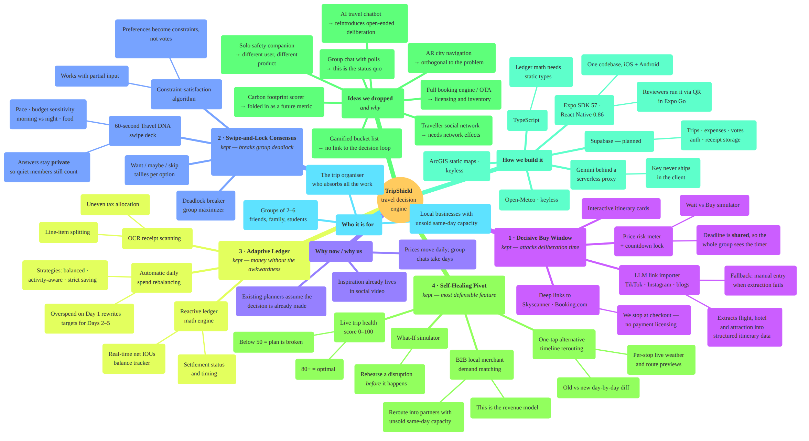

# TripShield by [Team Name]

**Team:** [Member 1], [Member 2], [Member 3], [Member 4]

**Problem Statement:** Travel Planner

**Video Presentation:** [Unlisted YouTube Link]

**Presentation Slides:** [Public Link]

---

## 1. Project Overview

### The Problem

Group travel planning breaks down at the moment of **decision**, not at the moment of inspiration.

**Causes as we understand them:**

1. **Inspiration is trapped in the wrong format.** Travellers save flights, hotels and attractions as TikTok reels, Instagram posts and screenshots. None of that is structured data, so every saved link has to be manually re-searched before it can be booked.
2. **Prices move faster than groups decide.** Flight and hotel prices shift daily, but a group chat takes days to reach agreement. By the time everyone replies, the fare that triggered the trip is gone.
3. **Group consensus has no mechanism.** "Anything also can" and silent members are the default. Preferences are never captured in a comparable form, so one loud voice or endless chat threads decide the itinerary.
4. **Money tracking is manual and socially awkward.** Receipts are paper, splits are uneven (one person did not eat the shared dish, another paid the taxi), and chasing repayment damages friendships.
5. **Plans are brittle.** A single rainstorm or traffic jam invalidates a full day, and replanning mid-trip means re-doing research on a phone, in a foreign country, under time pressure.

**Stakeholders:**

- **Primary:** Groups of 2–6 friends, families and student travellers planning multi-day trips on a shared budget.
- **Secondary:** The trip's *de facto* organiser, who absorbs the research, chasing and reconciliation work.
- **Tertiary:** Local businesses (cafés, tour operators, attractions) with unsold same-day capacity, and booking platforms / affiliates that lose conversions to deliberation drop-off.

**Existing solutions and why they fall short:**

| Existing app | What it does well | Where it falls short |
| --- | --- | --- |
| **Wanderlog** | Collaborative itinerary building, maps, notes | Static planner. It records decisions, it does not help groups *make* them, and it does not react when weather or traffic breaks the plan |
| **Google Trips / Travel** | Aggregates bookings from Gmail, price tracking on flights | Built for the solo traveller and only for items you already booked. No group consensus, no shared budget, no replanning |
| **Splitwise** | Expense splitting and debt simplification | Purely reactive bookkeeping after the trip. Every line item is typed by hand, and it has no link to the itinerary or the budget that is being blown |
| **TripIt** | Parses confirmation emails into a clean itinerary | Post-booking only. Useless during the deliberation phase, where most group trips actually die |

The common gap: **every one of these tools assumes the decision has already been made.** None of them compress the time between *seeing an option* and *committing to it*, which is exactly where group trips stall.

### Our Solution

TripShield is a mobile **travel decision engine**, not another itinerary notepad. It takes the four points where group trips stall — extracting options, agreeing on them, paying for them, and recovering when they break — and gives each one an explicit mechanism. Inspiration links are parsed into structured, bookable cards with a live price countdown; group preferences are captured through a 60-second swipe flow and resolved algorithmically instead of by chat; spending is tracked by scanning receipts and rebalanced against the remaining days; and when weather or traffic invalidates a day, the app scores the damage and offers a single-tap repaired plan.

**Feature set:**

1. **Decisive Buy Window & Smart Link Aggregator** — Paste a TikTok/Instagram/blog link; an LLM extracts the flight or hotel into an itinerary card. A price-risk meter and countdown lock tell you *when* to buy, and a deep link takes you straight to checkout.
2. **Swipe-and-Lock Consensus Engine** — Each member answers a short swipe questionnaire that maps their "Travel DNA". A constraint-satisfaction pass turns four conflicting preference sets into one locked schedule, with want / maybe / skip voting to break deadlocks.
3. **Adaptive Ledger & Dynamic Budget Splitter** — OCR receipt scanning splits bills line by line (including uneven tax allocation), tracks who owes whom, and dynamically recalibrates the remaining daily budget targets when a day goes over.
4. **Self-Healing Pivot & "What-If" Simulator** — A live Trip Health Score watches weather and routing. When the score drops, the app proposes a repaired itinerary with side-by-side old vs new comparison, live per-stop weather, and route previews. The What-If Simulator lets you rehearse other disruption scenarios before they happen.

---

## 2. Ideation & Process

### 2.1 Ideas We Considered

| Idea | Why it was kept / dropped |
| --- | --- |
| **A. Decisive Buy Window & Smart Link Aggregator (Chosen)** | **Kept.** This is the sharpest pain: inspiration lives in social media, but booking requires structured data. Extracting links into bookable cards plus a price countdown attacks deliberation time directly, which is our core thesis |
| **B. Swipe-and-Lock Consensus Engine (Chosen)** | **Kept.** Group deadlock is the single biggest reason trips die in the chat. Turning preferences into comparable data and resolving them algorithmically is a real mechanism, not another poll |
| **C. Adaptive Ledger & Dynamic Budget Splitter (Chosen)** | **Kept.** Splitwise proves the demand, but reactive bookkeeping is not enough. Tying spend to the *remaining* budget and rebalancing forward makes it a planning tool, not a receipt log |
| **D. Self-Healing Pivot & "What-If" Simulator (Chosen)** | **Kept.** This is our most defensible feature. No mainstream planner repairs a broken day. It also creates the B2B angle: rerouting travellers into partner businesses with unsold capacity |
| E. AI travel chatbot / conversational trip planner | **Dropped.** Crowded space, and a chat interface reintroduces exactly the open-ended deliberation we are trying to eliminate. Every general-purpose assistant already does a mediocre version of this |
| F. Social network for travellers (follow, feed, reviews) | **Dropped.** Needs network effects to be useful at all, which is impossible to demonstrate in a hackathon. It also does not solve a decision problem |
| G. Gamified travel bucket list with badges | **Dropped.** Engagement gimmick with no link to the core decision loop. Fun to build, hard to justify |
| H. Full booking engine / OTA (we handle payment) | **Dropped.** Payment licensing, inventory contracts and fraud handling are far outside scope. We deliberately stop at the deep link and hand off to existing platforms |
| I. AR city navigation overlay | **Dropped.** Technically attractive but orthogonal to the problem, and unusable as a group planning tool |
| J. Solo-traveller safety companion (check-ins, alerts) | **Dropped.** Genuine problem, different user and different product. Merging it would blur our positioning |
| K. Carbon-footprint trip scorer | **Dropped as a standalone product, folded in as a possible future metric.** Not enough on its own to motivate downloads |
| L. Group chat with built-in polls | **Dropped.** This is the status quo we are arguing against. A poll still requires everyone to show up and vote; our swipe + constraint solver works with partial input |

### 2.2 Ideation Boards


*Problem tree (first pass) — we put "Group Travel Decision Paralysis & Friction" at the centre and worked outwards. Four causes (clashing preferences, endless chat debates, budget disputes, static itineraries) each produce a distinct consequence, and those four consequences are what the four TripShield features exist to remove.*


*Problem tree (expanded) — we pushed each cause one level deeper to find the **root** cause, because "people can't agree" is a symptom, not something you can build against. Drilling down gave us the twelve blue root causes at the top, and those are what the features actually attack: "social pressure to seem agreeable hides real budgets" is why consensus is captured **privately** as Travel DNA, and "nothing monitors weather against the live plan" is why Trip Fix runs a continuous health score. The bottom row shows which mechanism answers which root cause. Source: [`problem-tree-detailed.mmd`](docs/ideation/problem-tree-detailed.mmd).*


*Mindmap (first pass) — once the problem tree told us **what** to solve, we branched outwards from the platform into four feature pillars and hung the concrete capabilities off each one. This is where the features stopped being themes and became buildable parts: "Live Trip Health Score 0 to 100", "60-Second Travel DNA Swipe Deck", "Google Vision OCR Receipt Scanning".*


*Mindmap (expanded) — the same four pillars taken down another level, plus the three branches that were missing from the first pass: **the ideas we dropped** and why, **how we build it** (stack and the constraints each choice carries), and **who it is for**. Keeping the rejected ideas on the same board matters — "group chat with polls" sitting next to our consensus engine is the clearest statement of what we are arguing against. Source: [`mindmap-detailed.mmd`](docs/ideation/mindmap-detailed.mmd).*

### 2.3 Mentor Consultation

| Date | Mentor | Feedback Received | What Was Changed |
| --- | --- | --- | --- |
| [DD/MM/YYYY] | [Mentor Name] | [Feedback] | [Change made, or why you chose not to] |
| [DD/MM/YYYY] | [Mentor Name] | [Feedback] | [Change made, or why you chose not to] |

---

## 3. Design & Prototype

**UI Prototype:** [Public Link — check it opens in an incognito window]

> Replace the placeholders below with screenshots from the running app.


*Home — the trip header plus four feature cards, each surfacing a live metric ("2 opportunities · 47h remaining"). The AI insight strip at the top is the only thing competing for attention.*


*Buy Window — a pasted link resolved into a bookable card, with the price-risk meter and countdown. The Wait vs Buy simulator sits directly under the price history so the tradeoff is visible without navigating away.*


*Consensus — the 60-second Travel DNA questionnaire. Each answer is private and becomes a constraint, not a public vote, so quiet members still influence the result.*


*Consensus result — want / maybe / skip tallies per option with the locked schedule below. Deadlocks are resolved by the solver rather than by re-opening the chat.*


*Adaptive Ledger — scanned receipt split line by line, with per-traveller shares and tax allocation. The budget ring shows the effect on the rest of the trip immediately.*


*Dynamic rebalancing — after an overspend, remaining daily targets are recalculated under the selected strategy (balanced / activity-aware / strict saving).*


*Trip Fix (Self-Healing) — the Trip Health Score with the repaired plan below. Each day expands to compare old vs new stops; tapping a weather chip fetches live conditions for that place and time.*


*What-If Simulator — rehearse a disruption (heavy rain, closure, delay) and see the rerouted timeline before committing.*

---

## 4. What Makes It Different

**Novel features and the twist in each:**

1. **Price countdown lock on a group decision, not a personal watchlist.** Fare trackers alert individuals. TripShield attaches the countdown to a *shared* itinerary card, so the deadline is visible to everyone who has to agree — it converts a vague "let's decide soon" into a timer the whole group can see.
2. **Social link → bookable card extraction.** Existing planners let you paste a URL as a note. We extract the actual flight/hotel/attraction into structured itinerary data and generate a deep link that lands on checkout, skipping the re-search step entirely.
3. **Travel DNA as private constraints instead of public votes.** The swipe questionnaire captures preference *shape* (pace, budget sensitivity, morning vs night, food adventurousness). The output is a constraint set fed to a solver, so the itinerary satisfies the group mathematically rather than rewarding whoever argues hardest.
4. **A ledger that changes the future, not just the past.** Splitwise tells you what you owe. Our ledger takes an overspend on Day 1 and rewrites the daily targets for Days 2–5 under a chosen strategy, so the budget stays achievable instead of just being violated.
5. **Self-healing itinerary with a visible health score.** The plan is continuously scored against weather and routing. Below the threshold, the app does not just warn — it produces a repaired itinerary with an explicit old vs new diff so the group can see exactly what changed and why.
6. **Disruption rehearsal (What-If).** Simulating alternative timelines *before* the disruption happens is, as far as we can find, absent from mainstream consumer travel apps.
7. **B2B demand matching as a side effect of rerouting.** When we reroute a group, the replacement stop can be a partner business with unsold same-day capacity — the recovery mechanism doubles as the revenue model.

**Comparison:**

| Capability | Wanderlog | Google Travel | Splitwise | TripIt | **TripShield** |
| --- | --- | --- | --- | --- | --- |
| Extracts bookable items from social links | ✗ | ✗ | ✗ | ✗ | **✓** |
| Tells you *when* to buy (price window) | ✗ | Partial (flights) | ✗ | ✗ | **✓** |
| Algorithmic group consensus | ✗ | ✗ | ✗ | ✗ | **✓** |
| Receipt OCR with uneven line-item splits | ✗ | ✗ | Partial (manual) | ✗ | **✓** |
| Forward-looking budget rebalancing | ✗ | ✗ | ✗ | ✗ | **✓** |
| Repairs a broken day automatically | ✗ | ✗ | ✗ | ✗ | **✓** |
| Simulates disruptions before they happen | ✗ | ✗ | ✗ | ✗ | **✓** |

---

## 5. Technical Architecture & Feasibility

### Tech Stack

| Layer | Choice | Why we chose it | Constraints we expect |
| --- | --- | --- | --- |
| **Mobile frontend** | **Expo SDK 57** + **React Native 0.86** | One TypeScript codebase for iOS and Android, and Expo Go lets reviewers run the app by scanning a QR code with no build pipeline | Expo Go cannot load custom native modules; anything needing one (real OCR camera SDK) requires a development build |
| **Language** | **TypeScript 6** | The ledger and consensus logic are data-heavy; static types catch split/rounding errors before runtime | Strict mode slows early iteration, accepted as a tradeoff |
| **Web preview** | **React Native Web** + **Vite 8** | Same components render in a browser phone mockup, so we can demo and iterate without a device | Some RN styles (`shadow*`) degrade on web; a few screens have a `.native.tsx` variant |
| **UI / styling** | `expo-linear-gradient`, `@expo/vector-icons`, `react-native-safe-area-context`, `react-native-screens`, shared theme tokens (`src/utils/appTheme.ts`) | Centralised gradient + typography tokens keep four independently built features visually consistent | Manual discipline; no design-system enforcement in CI |
| **LLM / extraction** | **Google Gemini API** (server-side key) | Needed for unstructured link → structured itinerary extraction and receipt parsing; generous free tier for a hackathon | API key must never ship in the client; needs a thin proxy before any public release. Rate limits and latency on cold calls |
| **Weather** | **Open-Meteo** (`api.open-meteo.com`) | Free, no API key, hourly forecast by lat/lng — ideal for per-stop weather in the Self-Healing flow | No key means no guaranteed SLA; we cache and fall back to bundled snapshots when the call fails |
| **Maps / route previews** | **ArcGIS World Street Map** static export (with Yandex static as fallback) | Keyless static map images for route previews; street rendering is more legible than satellite at itinerary zoom levels | No routing engine — previews are illustrative. Real turn-by-turn would need Google Directions or Mapbox (both keyed and metered) |
| **State / data** | React hooks + typed mock data modules (`src/data/*`) | Lets us prove the full interaction model for all four features without waiting on a backend | No persistence across restarts yet; this is the first thing to replace |
| **Hosting (planned)** | **Expo EAS** for app distribution; **Supabase** (Postgres + Auth + Storage) for trips, expenses and votes; a small serverless function for the Gemini proxy | Supabase free tier covers our data volume and gives auth and row-level security without writing a backend | Free tier pauses on inactivity; the Gemini proxy still needs its own host (Vercel/Cloudflare Workers free tier) |

### System Architecture

```
┌──────────────────────────────────────────────────────────┐
│  Expo / React Native client  (iOS · Android · Web)       │
│                                                          │
│  Buy Window │ Consensus │ Ledger │ Trip Fix (Self-Heal)  │
│  shared theme tokens · shared header + nav components    │
└───────────┬──────────────────────────────┬───────────────┘
            │                              │
            │ (planned)                    │ direct, keyless
            ▼                              ▼
┌───────────────────────────┐   ┌──────────────────────────┐
│  Serverless API proxy     │   │  Open-Meteo  (weather)   │
│  · Gemini link extraction │   │  ArcGIS      (map tiles) │
│  · Receipt OCR parsing    │   └──────────────────────────┘
│  · hides API keys         │
└───────────┬───────────────┘
            ▼
┌───────────────────────────┐
│  Supabase (planned)       │
│  trips · expenses · votes │
│  auth · receipt storage   │
└───────────────────────────┘
```

Today the client is self-contained and runs entirely against typed mock data. The dashed-in layers are what the building phase adds.

### Build Plan & Scope

**What is already working:**

- All four feature flows are navigable end to end on device, against realistic mock data.
- A unified visual system: shared sky gradient, Ledger-style headers with subtitles and back navigation, and consistent bottom navigation (Buy Window · Plan · Budget · Fix Trip).
- Trip Fix computes a live health score, renders repaired vs original plans day by day, fetches **live** Open-Meteo weather per stop, and shows real street-map route previews.
- Ledger performs line-item splitting with uneven tax allocation and settlement tracking.

**What we will build during the building phase (deliberately narrow):**

1. **Real link extraction** — replace the mocked parser with a Gemini call behind a serverless proxy, targeting flights and hotels first. Attractions only if time allows.
2. **Receipt OCR** — camera capture → Gemini vision → editable draft expense. The manual-entry path stays as the fallback, so a failed scan never blocks the user.
3. **Persistence and multi-user** — Supabase schema for trips, expenses, votes and settlements, plus auth. This is what turns the consensus feature from a demo into something a real group can use.
4. **Live price signal** — one flight data source wired to the Buy Window countdown, with the risk meter driven by real history instead of mock series.
5. **Hardening** — offline fallbacks for weather and maps, error states on every network call, and a development build for the camera.

**Explicitly out of scope:** in-app payment or checkout (we deep-link out), hotel/flight inventory contracts, AR navigation, social feed, and the B2B partner dashboard. The B2B rerouting angle is presented as the business model, not as shipped software.

---

## Run Locally

**Prerequisites:** Node.js 18+

1. Install dependencies:

   ```bash
   npm install
   ```

2. Create `.env.local` from [.env.example](.env.example) and set `GEMINI_API_KEY`.

3. Run the app:

   ```bash
   npm start        # Expo — scan the QR code with Expo Go
   npm run tunnel   # Expo over a public tunnel (required on GitHub Codespaces / remote VMs)
   npm run dev      # Web preview in the browser
   ```

4. Type-check:

   ```bash
   npm run lint
   ```

> On GitHub Codespaces, `npm start` prints a QR pointing at a private container IP that a phone cannot reach — use `npm run tunnel` instead.
