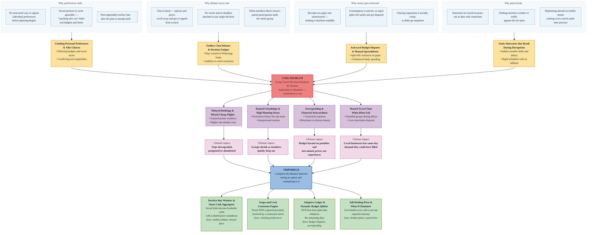
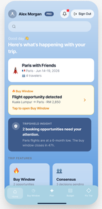
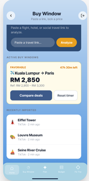
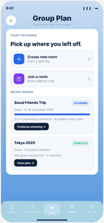
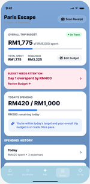
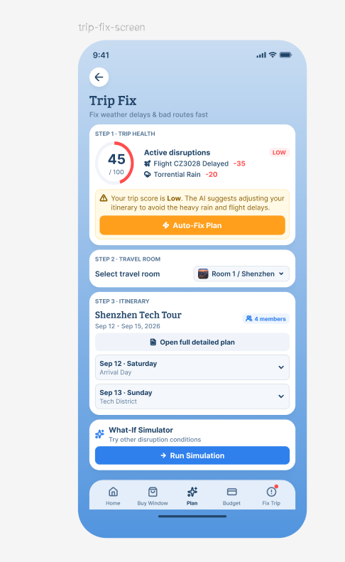
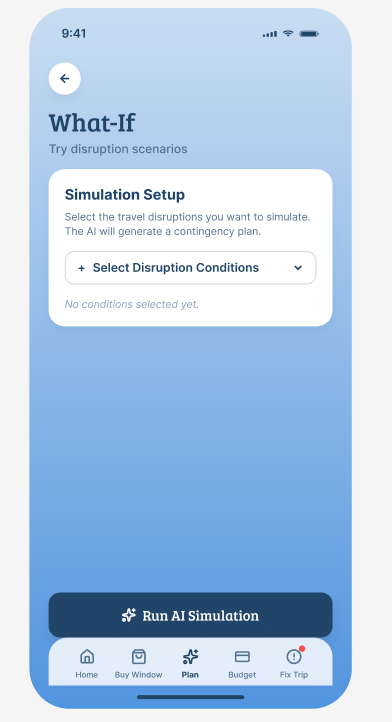
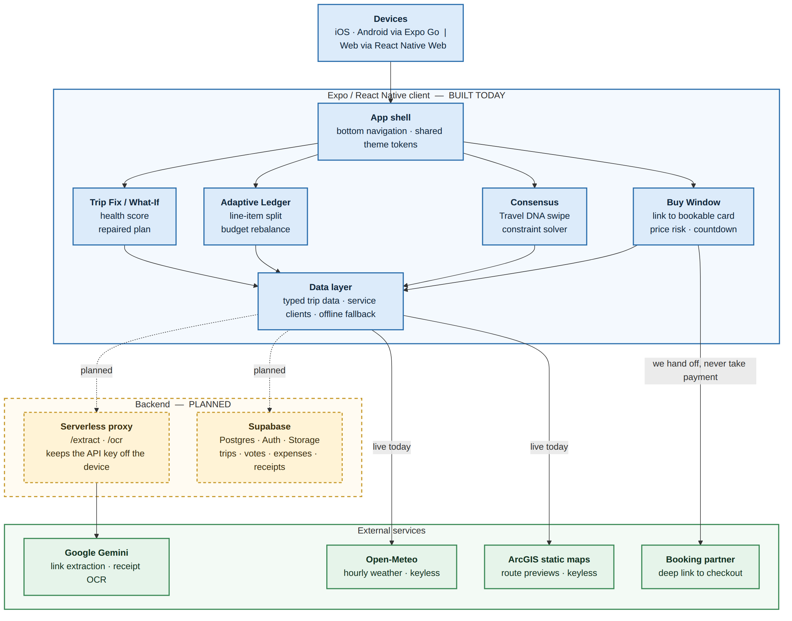

# TripShield by OnTheWay

**Team:** Then Fung Maye, Ham Zeng Yi, Ee Si Ying, Kuan Hui Min

**Problem Statement:** Travel Planner

**Video Presentation:** https://youtu.be/FqsIUzmcEDU

**Presentation Slides:** [[Slide]](https://canva.link/6w6ovgakux7xij7)

---

## 1. Project Overview

### The Problem

Group travel planning breaks down at the moment of **decision**, not at the moment of inspiration. A group can agree on a destination in an hour, then spend three weeks failing to agree on anything bookable — while fares rise, quiet members go unheard, spending goes untracked and one rainstorm wipes out a day nobody can replan on the spot. Every existing tool either records a decision that has already been made or serves one buyer at a time, so the decision itself is left to the group chat, which is exactly where trips get expensive, compromised or abandoned.

**Who we are building for**

- **Primary:** Groups of **2–6 friends** (especially **Gen Z and young adults**) planning a **multi-day trip on a shared budget** — the same segment where industry surveys report the highest group-travel friction.
- **Secondary:** The *de facto* organiser who does the research, chases replies, and reconciles money after the trip.
- **Not our focus:** Solo business travel, large tour groups, or in-trip booking marketplaces (we deep-link out for payment).

**Evidence that the problem is real**

Planning a trip with friends sounds exciting, but it can quickly become stressful. The issue is not travelling together — it is getting everyone to agree on **money, activities, and expectations** before and during the trip.

| Source | What it says | Why it matters for TripShield |
| --- | --- | --- |
| **[Vrbo — *Group travel made easy*](https://www.expedia.ca/newsroom/vrbos-guide-to-spring-break-and-group-travel/)** (Expedia Newsroom, 5 Mar 2026) | **37%** of Canadian travellers said they had gotten into a **fight** on a group vacation; **57%** among **Gen Z**. Friction around **money**, **accommodation expectations**, and **different preferences**. | Matches our problem tree: budget disputes, clashing preferences, and chat-driven deadlock — not a lack of inspiration. |
| **[Song, Wang & Sparks (2017)](https://doi.org/10.1080/10548408.2017.1421117)** — *How do young Chinese friendship groups make travel decisions?* | Observed **10 friendship groups**; destination choice hinged on **activities, cost, timing, transport, climate, safety, distance** — with heavy **group discussion** and social pressure to keep harmony. | Academic backing that group trips are multi-factor and **consensus-heavy**; a structured decision layer beats an open-ended chat. |

**Story → problem → TripShield (for presentations):**  
*"A 2026 Vrbo study found more than a third of group travellers had fought on vacation — higher still for Gen Z. TripShield does not replace booking sites; it turns each member’s preferences and constraints into one **decision** the group can lock — Buy Window, Consensus, Budget, and Trip Fix — instead of endless group-chat threads."*

**Causes as we understand them:**

1. **Inspiration is trapped in the wrong format.** Flights, hotels and attractions are saved as TikTok reels, screenshots and links — no dates, no prices, no coordinates — so every saved item must be manually re-searched before it can be compared or booked.
2. **Prices move faster than groups decide.** Fares move daily; group agreement moves in days or weeks. The group cannot go faster than its slowest member, and nothing shows what hesitating is costing them.
3. **Group consensus has no mechanism.** "Anything also can" is rarely honest — social pressure hides real budgets, preferences are never comparable, and a chat has no notion of a closed decision, so the loudest or fastest voice wins.
4. **Money tracking is manual and socially awkward.** Splits are genuinely uneven, nobody types line items during a holiday, and chasing repayment afterwards costs more socially than the money is worth.
5. **Plans are brittle.** Nothing monitors the itinerary against weather or traffic, so a broken day is discovered by walking into it — and replanning happens on a phone, abroad, under time pressure.

**Stakeholders:**

- **Primary:** Same as **Who we are building for** above — young friend groups on a shared budget.
- **Secondary:** The trip's *de facto* organiser, who absorbs the research, chasing and reconciliation work.
- **Tertiary:** Local businesses (cafés, tour operators, attractions) with unsold same-day capacity, and booking platforms / affiliates that lose conversions to deliberation drop-off.

**Existing solutions and why they fall short:**

| Existing app | What it does well | Where it falls short |
| --- | --- | --- |
| **Wanderlog** | Collaborative itinerary building, maps, notes | Static planner. It records decisions, it does not help groups *make* them, and it does not react when weather or traffic breaks the plan |
| **Google Trips / Travel** | Aggregates bookings from Gmail, price tracking on flights | Built for the solo traveller and only for items you already booked. No group consensus, no shared budget, no replanning |
| **Splitwise** | Expense splitting and debt simplification | Purely reactive bookkeeping after the trip. Every line item is typed by hand, and it has no link to the itinerary or the budget that is being blown |
| **TripIt** | Parses confirmation emails into a clean itinerary | Post-booking only. Useless during the deliberation phase, where most group trips actually die |
| **Trip.com** | Huge flight/hotel/activity inventory, competitive fares, booking completed in-app | A conversion funnel built for one buyer. It optimises a single search at a time, with no shared shortlist, no way for four people to converge on one option, no budget tracking after payment and no response when the booked day is rained out |
| **TripAdvisor** | Reviews, rankings and "things to do" at a scale nobody else has | Discovery ends at the shortlist. Saved places never become an agreed, time-ordered plan, there is no consensus or money layer, and a 4.5-star ranking says nothing about whether that stop still works in today's weather |

The common gap: **these tools either assume the decision has already been made, or serve one buyer at a time.** None of them compress the time between *seeing an option* and *a group committing to it*, which is exactly where group trips stall.

### Our Solution

TripShield is a mobile **travel decision engine**, not another itinerary notepad. It targets the four points where group trips stall — extracting options, agreeing on them, paying for them, and recovering when they break — and gives each one an explicit mechanism. Pasted inspiration links become bookable cards with a live price countdown, a 60-second swipe flow resolves group preferences algorithmically instead of by chat, and scanned receipts rebalance the budget across the days that are left. When weather or traffic invalidates a day, the app scores the damage and offers a single-tap repaired plan.

**Feature set:**

1. **Decisive Buy Window & Smart Link Aggregator** — Paste a TikTok/Instagram/blog link; an LLM extracts the flight or hotel into an itinerary card. A price-risk meter and countdown lock tell you *when* to buy, and a deep link takes you straight to checkout.
2. **Swipe-and-Lock Consensus Engine** — Each member answers a short swipe questionnaire that maps their "Travel DNA". A constraint-satisfaction pass turns four conflicting preference sets into one locked schedule, with want / maybe / skip voting to break deadlocks.
3. **Adaptive Ledger & Dynamic Budget Splitter** — Receipt scan (or manual entry) produces **editable line items**; each person is assigned to what they consumed, tax is split fairly, and overspending **recalibrates** the remaining daily targets.
4. **Self-Healing Pivot & "What-If" Simulator** — A live Trip Health Score watches weather and routing. When the score drops, the app proposes a repaired itinerary with side-by-side old vs new comparison, live per-stop weather, and route previews. The What-If Simulator lets you rehearse other disruption scenarios before they happen.

---

## 2. Ideation & Process

### 2.1 Ideas We Considered

| Idea | Why it was kept / dropped |
| --- | --- |
| **A. Decisive Buy Window & Smart Link Aggregator (Chosen)** | **Kept.** This is the sharpest pain: inspiration lives in social media, but booking requires structured data. Extracting links into bookable cards plus a price countdown attacks deliberation time directly, which is our core thesis |
| **B. Swipe-and-Lock Consensus Engine (Chosen)** | **Kept.** Group deadlock is the single biggest reason trips die in the chat. Turning preferences into comparable data and resolving them algorithmically is a real mechanism, not another poll |
| **C. Adaptive Ledger & Dynamic Budget Splitter (Chosen)** | **Kept.** Splitwise proves the demand, but reactive bookkeeping is not enough. Tying spend to the *remaining* budget and rebalancing forward makes it a planning tool, not a receipt log |
| **D. Self-Healing Pivot & "What-If" Simulator (Chosen)** | **Kept.** This is our most defensible feature. No mainstream planner repairs a broken day. It also creates the B2B angle: rerouting travellers into partner businesses with unsold capacity |
| E. AI travel chatbot / conversational trip planner | **Dropped.** Crowded space, and a chat interface reintroduces exactly the open-ended deliberation we are trying to eliminate. Every general-purpose assistant already does a mediocre version of this |
| F. Social network for travellers (follow, feed, reviews) | **Dropped.** Needs network effects to be useful at all, which is impossible to demonstrate in a hackathon. It also does not solve a decision problem |
| G. Gamified travel bucket list with badges | **Dropped.** Engagement gimmick with no link to the core decision loop. Fun to build, hard to justify |
| H. Full booking engine / OTA (we handle payment) | **Dropped.** Payment licensing, inventory contracts and fraud handling are far outside scope. We deliberately stop at the deep link and hand off to existing platforms |
| I. AR city navigation overlay | **Dropped.** Technically attractive but orthogonal to the problem, and unusable as a group planning tool |
| J. Solo-traveller safety companion (check-ins, alerts) | **Dropped.** Genuine problem, different user and different product. Merging it would blur our positioning |
| K. Carbon-footprint trip scorer | **Dropped as a standalone product, folded in as a possible future metric.** Not enough on its own to motivate downloads |
| L. Group chat with built-in polls | **Dropped.** This is the status quo we are arguing against. A poll still requires everyone to show up and vote; our swipe + constraint solver works with partial input |

### 2.2 Ideation Boards


*Source: [`docs/ideation/problem-tree-detailed.png`](docs/ideation/problem-tree-detailed.png)*

### 2.3 Mentor Consultation

| Date | Mentor | Feedback Received | What Was Changed |
| --- | --- | --- | --- |
| 09/09/2026 | Mah Qing Fung | Focus on the group **decision** gap before and after booking, not becoming an OTA. | Kept checkout as a deep link only; prioritised Buy Window + Consensus over in-app payment. |
| 13/09/2026 | Looi Wei | Strengthen the **README** (not only the video): cite **research** for the problem statement, state the **target group** clearly, and align non-video submission items with the template. Asked how receipt OCR knows *who ordered what* — clarified it is **scan → draft lines → user assigns people** (calculator-style split, not automatic face matching). UI is clear; live video was hard to follow when voiceover did not track the on-screen flow (noted for future pitches). | Added **Evidence that the problem is real** (Vrbo 2026 + Song et al. 2017), a **Who we are building for** block, and clearer ledger wording on **manual assignment** after scan. Checked README against the submission template before deadline. |

---

## 3. Design & Prototype

**UI Prototype (Figma):** https://www.figma.com/design/Cvm1n2sWtqcTqd3zDarNtU/Untitled?node-id=0-1&t=Ndm2XFmKttBEd0bM-1

Screens below are from the running Expo app (same flows as the prototype). Each image is cropped to the phone frame.


*Welcome — TripShield logo, **Sign Up** / **Login**, and a skip path for demo reviewers.*



*Home — active trip card, **Buy Window** alert on a fare opportunity, and **TripShield Insight** pointing at decisions that need action.*



*Buy Window — paste a TikTok or booking link, see **active buy windows** with price and countdown, plus recently imported ideas.*



*Group Plan — create or join a trip room, then continue **Seoul Friends Trip** or open a completed plan like **Tokyo 2025**.*



*Budget — overall trip spend vs cap, **today’s target**, overspend warnings, and receipt scan entry for splits.*



*Trip Fix — **Trip Health** score, listed disruptions, **Auto-Fix Plan**, and the group itinerary with a link to **What-If** simulation.*



*What-If — pick disruption scenarios and **Run AI Simulation** before committing to a reroute.*

---

## 4. What Makes It Different

**Novel features and the twist in each:**

1. **Price countdown lock on a group decision, not a personal watchlist.** Fare trackers alert individuals. TripShield attaches the countdown to a *shared* itinerary card, so the deadline is visible to everyone who has to agree — it converts a vague "let's decide soon" into a timer the whole group can see.
2. **Social link → bookable card extraction.** Existing planners let you paste a URL as a note. We extract the actual flight/hotel/attraction into structured itinerary data and generate a deep link that lands on checkout, skipping the re-search step entirely.
3. **Travel DNA as private constraints instead of public votes.** The swipe questionnaire captures preference *shape* (pace, budget sensitivity, morning vs night, food adventurousness). The output is a constraint set fed to a solver, so the itinerary satisfies the group mathematically rather than rewarding whoever argues hardest.
4. **A ledger that changes the future, not just the past.** Splitwise tells you what you owe. Our ledger takes an overspend on Day 1 and rewrites the daily targets for Days 2–5 under a chosen strategy, so the budget stays achievable instead of just being violated.
5. **Self-healing itinerary with a visible health score.** The plan is continuously scored against weather and routing. Below the threshold, the app does not just warn — it produces a repaired itinerary with an explicit old vs new diff so the group can see exactly what changed and why.
6. **Disruption rehearsal (What-If).** Simulating alternative timelines *before* the disruption happens is, as far as we can find, absent from mainstream consumer travel apps.
7. **B2B demand matching as a side effect of rerouting.** When we reroute a group, the replacement stop can be a partner business with unsold same-day capacity — the recovery mechanism doubles as the revenue model.

**TripShield vs competitors — planning functions**

Booking apps (Trip.com, Skyscanner, Booking.com, Agoda, Traveloka) optimise **search and checkout for one buyer**. TripShield optimises **group planning, decisions, money, and recovery** — the layer none of them ship.

| Planning function | Trip.com | Skyscanner | Booking.com | Agoda | Traveloka | **TripShield** |
| --- | --- | --- | --- | --- | --- | --- |
| Import travel ideas from TikTok / Instagram links | ❌ | ❌ | ❌ | ❌ | ❌ | **✅** |
| Turn links into itinerary cards | ❌ | ❌ | ❌ | ❌ | ❌ | **✅** |
| Group member preference collection | ❌ | ❌ | ❌ | ❌ | ❌ | **✅** |
| Budget preference collection from each member | ❌ | ❌ | ❌ | ❌ | ❌ | **✅** |
| Travel “vibe” / Travel DNA matching | ❌ | ❌ | ❌ | ❌ | ❌ | **✅** |
| Automatically find overlap between group preferences | ❌ | ❌ | ❌ | ❌ | ❌ | **✅** |
| Automatically resolve group disagreement | ❌ | ❌ | ❌ | ❌ | ❌ | **✅** |
| Deadlock breaker | ❌ | ❌ | ❌ | ❌ | ❌ | **✅** |
| Automatically lock a group decision | ❌ | ❌ | ❌ | ❌ | ❌ | **✅** |
| Price-based Buy Window | ❌ | ⚠️ Price discovery | ❌ | ❌ | ⚠️ Price alerts | **✅** |
| Countdown to encourage group decision | ❌ | ❌ | ❌ | ❌ | ❌ | **✅** |
| Shared group expense tracking | ❌ | ❌ | ❌ | ❌ | ❌ | **✅** |
| Receipt OCR for expense splitting | ❌ | ❌ | ❌ | ❌ | ❌ | **✅** |
| Real-time IOU calculation | ❌ | ❌ | ❌ | ❌ | ❌ | **✅** |
| Adjust future spending after overspending | ❌ | ❌ | ❌ | ❌ | ❌ | **✅** |
| Monitor trip health | ❌ | ❌ | ❌ | ❌ | ❌ | **✅** |
| Detect weather / route / schedule problems | ❌ | ❌ | ❌ | ❌ | ❌ | **✅** |
| What-if itinerary simulation | ❌ | ❌ | ❌ | ❌ | ❌ | **✅** |
| Automatically re-plan after disruption | ❌ | ❌ | ❌ | ❌ | ❌ | **✅** |
| Suggest alternative activities when plans break | ❌ | ❌ | ❌ | ❌ | ❌ | **✅** |

**The important difference:** Competitors help someone **find and pay for a fare or room**. TripShield helps a **group decide together**, **stay on budget during the trip**, and **recover when the plan breaks** — with a shared Buy Window, consensus engine, adaptive ledger, and Trip Fix / What-If. We still **deep-link to booking sites** for payment; we do not compete on inventory.

**What we deliberately concede:** In-app checkout and supplier contracts (Trip.com / Booking.com / Agoda own that). Skyscanner and Traveloka may surface **individual** fares or alerts; they do not close a **group** decision or run the rows above.

---

## 5. Technical Architecture & Feasibility

### Tech Stack

| Layer | Choice | Why we chose it | Constraints we expect |
| --- | --- | --- | --- |
| **Mobile frontend** | **Expo SDK 57** + **React Native 0.86** | One TypeScript codebase for iOS and Android, and Expo Go lets reviewers run the app by scanning a QR code with no build pipeline | Expo Go cannot load custom native modules; anything needing one (real OCR camera SDK) requires a development build |
| **Language** | **TypeScript 6** | The ledger and consensus logic are data-heavy; static types catch split/rounding errors before runtime | Strict mode slows early iteration, accepted as a tradeoff |
| **Web preview** | **React Native Web** + **Vite 8** | Same components render in a browser phone mockup, so we can demo and iterate without a device | Some RN styles (`shadow*`) degrade on web; a few screens have a `.native.tsx` variant |
| **UI / styling** | `expo-linear-gradient`, `@expo/vector-icons`, `react-native-safe-area-context`, `react-native-screens`, shared theme tokens (`src/utils/appTheme.ts`) | Centralised gradient + typography tokens keep four independently built features visually consistent | Manual discipline; no design-system enforcement in CI |
| **LLM / extraction** | **Google Gemini API** (server-side key) | Needed for unstructured link → structured itinerary extraction and receipt parsing; generous free tier for a hackathon | API key must never ship in the client; needs a thin proxy before any public release. Rate limits and latency on cold calls |
| **Weather** | **Open-Meteo** (`api.open-meteo.com`) | Free, no API key, hourly forecast by lat/lng — ideal for per-stop weather in the Self-Healing flow | No key means no guaranteed SLA; we cache and fall back to bundled snapshots when the call fails |
| **Maps / route previews** | **ArcGIS World Street Map** static export (with Yandex static as fallback) | Keyless static map images for route previews; street rendering is more legible than satellite at itinerary zoom levels | No routing engine — previews are illustrative. Real turn-by-turn would need Google Directions or Mapbox (both keyed and metered) |
| **State / data** | React hooks + typed mock data modules (`src/data/*`) | Lets us prove the full interaction model for all four features without waiting on a backend | No persistence across restarts yet; this is the first thing to replace |
| **Hosting (planned)** | **Expo EAS** for app distribution; **Supabase** (Postgres + Auth + Storage) for trips, expenses and votes; a small serverless function for the Gemini proxy | Supabase free tier covers our data volume and gives auth and row-level security without writing a backend | Free tier pauses on inactivity; the Gemini proxy still needs its own host (Vercel/Cloudflare Workers free tier) |

### System Architecture



*Source: [`docs/architecture/system-architecture.png`](docs/architecture/system-architecture.png)*


### Build Plan & Scope

**What is already working:**

- All four feature flows are navigable end to end on device, against realistic mock data.
- A unified visual system: shared sky gradient, Ledger-style headers with subtitles and back navigation, and consistent bottom navigation (Buy Window · Plan · Budget · Fix Trip).
- Trip Fix computes a live health score, renders repaired vs original plans day by day, fetches **live** Open-Meteo weather per stop, and shows real street-map route previews.
- Ledger performs line-item splitting with uneven tax allocation and settlement tracking.

**What we will build during the building phase.** Five items, in this order. We would rather ship four of them properly than start all five, so items 4 and 5 are explicitly cuttable.

| # | What ships | Done when | If it slips |
| --- | --- | --- | --- |
| 1 | **Real link extraction** — the mocked parser replaced by a Gemini call behind our serverless proxy. **Flights and hotels only**; attractions are not attempted | Pasting a public hotel or flight URL returns a card with name, date, price and location, and the user can correct any field before saving | The manual card form already exists, so unsupported links degrade to manual entry rather than an error |
| 2 | **Receipt OCR** — camera capture → Gemini vision → an *editable draft* expense. The draft is never committed without review | A photographed receipt produces line items whose total matches the printed total, and every row can be edited before saving | Manual entry stays the default path; a failed scan costs the user nothing |
| 3 | **Persistence and multi-user** — Supabase schema for trips, votes, expenses and settlements, plus auth and join-by-invite-link | Two phones signed into the same trip see the same votes and expenses after a reload | Local device persistence only, so state survives a restart even without the backend |
| 4 | **Live price signal** — one flight data source wired into the Buy Window countdown, so the risk meter reads real history | The meter and countdown for at least one real route are driven by fetched prices, not a mock series | Keep the mock series, labelled *sample data* on screen so nothing is misrepresented |
| 5 | **Hardening** — loading, empty, error and offline states on every network call, cached weather, and an EAS development build for the camera | The app is usable end to end with the network disabled | Ship the dev build for the camera only; the remaining states stay as-is |

---

## Run Locally

**Prerequisites:** Node.js 18+

1. Install dependencies:

   ```bash
   npm install
   ```

2. Create `.env.local` from [.env.example](.env.example) and set `GEMINI_API_KEY`.

3. Run the app:

   ```bash
   npm start        # Expo — scan the QR code with Expo Go
   npm run tunnel   # Expo over a public tunnel (required on GitHub Codespaces / remote VMs)
   npm run dev      # Web preview in the browser
   ```

4. Type-check:

   ```bash
   npm run lint
   ```

> On GitHub Codespaces, `npm start` prints a QR pointing at a private container IP that a phone cannot reach — use `npm run tunnel` instead.
